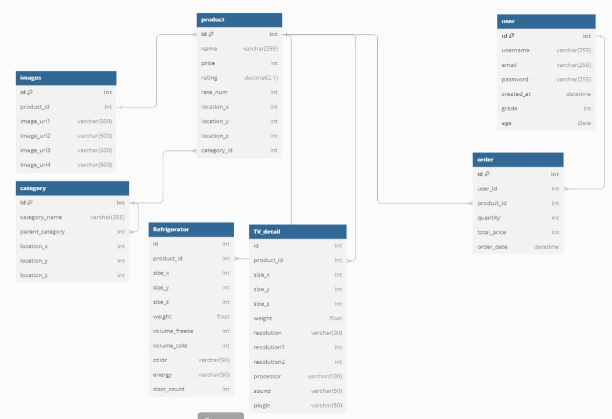
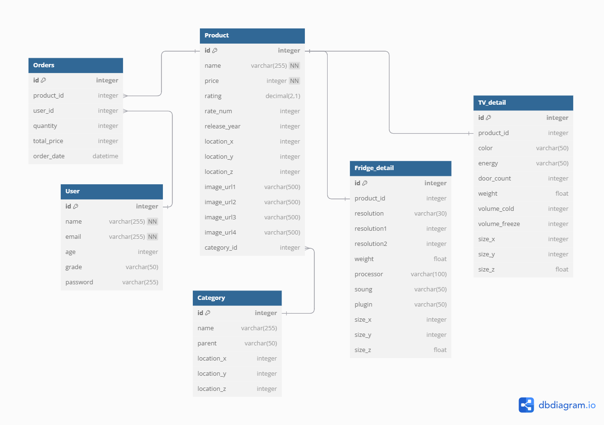
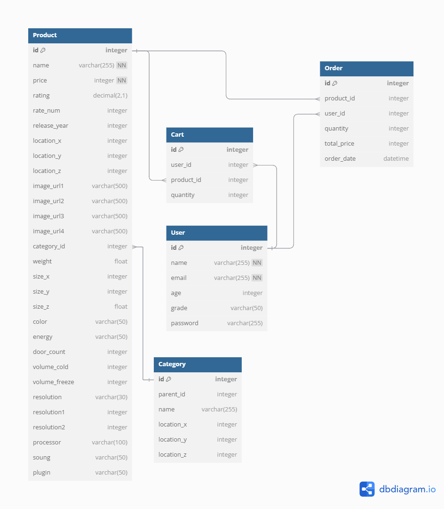

# shoppingnova-back

## 백엔드 기능 목록

1. 회원가입과 로그인
    - 이메일, PW로 로그인 가능.
    - 회원가입 페이지에서 필수정보 입력후 가입 가능.

2. 상품 조회(Read)
    - 카테고리를 클릭하여 세부사항으로 이동->단일 제품 조회.
    - 제품 정렬 (가격, 평점 기준 오름차순 내림차순 제공) 필터.
    - 이름 검색을 통한 세부 카테고리 이동.

3. 상품 주문하기
    - 장바구니에 담아서 한번에 주문하기.
    - 상품조회창에서 바로 주문하기(단일상품).
    - 상품 주문시 주문 목록에 추가됨.

4. 장바구니 담기
    - 장바구니에 최대 10개까지 상품을 담을 수 있다.
    - 동일 상품도 각각 담기게 되며, 결제는 장바구니 내역을 한번에 해야 한다. 
    - (프론트) 장바구니에 상품을 담게 되면, 별이 장바구니 목록에 담기는 UI를 보여준다.-> (백엔드)좌표이동 필요

5. 상품 평점 작성
    - 상품에 평점을 추가할 수 있다.
    - 상품 후기 작성은 상품 구해후 가능하다.

6. 타임세일,한정판 상품목록 조회하기
    - 타임세일 상품의 경우 시간제한 설정
    - 한정판의 경우 남은 재고 표시
    - (프론트)구매 불가 상태가 된 경우, 별이 폭발하는 UI(초신성)-> (백엔드)상품 자동 삭제 

7. 판매 상품관리
    - 관리자는 상품의 변경사항을 관리하고, 판매종료 상품은 제거한다(Update, Delete)
    - 가격 할인, 타임세일, 한정판 같은 이벤트를 관리한다. 

## 개발 목표

#### 1차 : 회원가입및 로그인 기능, 상품 DB구성, 카테고리 이동및 단일상품 조회, 상품평점 추가.
#### 2차 : 사용자의 필터링,검색 상품조회, 상품 주문하기, 장바구니 담기및 주문하기.

## 1차 ERD

## 2차 ERD

## 3차 ERD

## API 테이블

| 번호 | API 종류    | 기능                     | API 명                | 설명                                           |
|------|-------------|-------------------------|-----------------------|------------------------------------------------|
| 1    | User        | 회원 가입                | user.register         | 새로운 사용자 정보 저장                         |
| 2    |             | 로그인                   | user.login            | 기존 사용자 정보로 로그인                       |
| 3    | Product     | 전체 제품 목록           | product.list           | 전체 제품 목록과 각 제품의 기본 정보 조회        |
| 4    |             | 특정 제품 상세 정보      | product.info           | 특정 제품의 상세 정보 모두 조회                  |
| 5    |             | 제품 정렬                | product.sort          | 가격, 평점을 기준으로 높은 순, 낮은 순으로 정렬   |
| 6    | Category    | 상위 카테고리            | category.parent       | 상위 카테고리 종류 조회                          |
| 7    |             | 하위 카테고리            | category.child        | 하위 카테고리 종류 조회                          |
| 8    |             | 하위 카테고리별 제품 목록 | category.childList    | 하위 카테고리 제품 목록과 각 제품의 기본 정보 조회 |
| 9    | Cart        | 장바구니 목록            | cart.list             | 장바구니 목록 조회                               |
| 10   |             | 장바구니 담기            | cart.append           | 장바구니에 제품 추가                             |
| 11   |             | 장바구니 삭제            | cart.delete           | 장바구니에서 제품 삭제                           |
